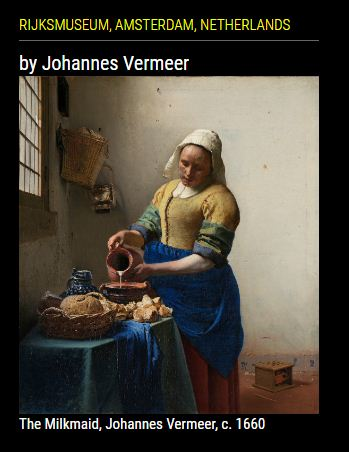

## MMM-Art

Centuries old artwork from the Rijksmuseum, Amsterdam, Netherlands.

## How dare you, Mykle?

Is it presumptuous of me to create a module, using an API for a museum that I've never been to?
Hell, I've never been to Amsterdam, either, but my answer is still, "No, it's not."
I like art. I like making MM modules. I found the API and you didn't. ;^)

## How it works

No big secret here. The artist's name. Below that the artwork is displayed.
Below that, the name of the piece, the artist's name again, and the year.

## Examples

* Shown with header

, .
You will get a code immediately.`

## Config.js entry and options

    {
        module: 'MMM-Art',
        position: 'top_left',              // Works well anywhere
        config: {
			apiKey: "apiKey goes here",    // Enter your apiKey
		    useHeader: true,              // true if you want a header
            header: "Rijksmuseum, Amsterdam, Netherlands",   // Any text you want
		    maxWidth: "300px",             // Stretch or constrain according to region
		    animationSpeed: 3000,          // New artwork fades in and out
        }
    },
	

## For art lovers everywhere!